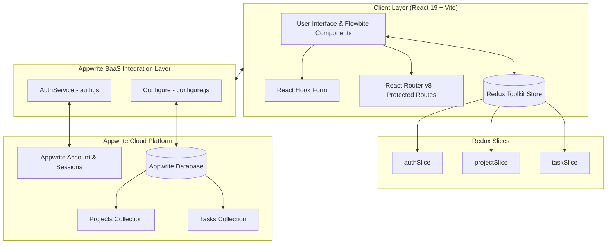

<div align="center">

# 🚀 TaskPulse — Project Management System

**A modern, full-stack collaborative project and task management dashboard designed for streamlined workflow tracking, real-time analytics, and task lifecycle execution.**

<br />

[](https://react.dev/)
[](https://vitejs.dev/)
[](https://redux-toolkit.js.org/)
[](https://tailwindcss.com/)
[](https://appwrite.io/)
[](https://reactrouter.com/)
[](https://flowbite.com/)

<br />

[Explore Features](#-key-features) • [Architecture](#-system-architecture) • [Getting Started](#-getting-started) • [Environment Variables](#-environment-variables) • [Database Schema](#-database--collection-schema) • [Project Structure](#-project-structure)

</div>

---

## 📖 Overview

The **Project Management System** is a responsive web application built with **React 19**, **Redux Toolkit**, **Tailwind CSS v4**, and **Appwrite Cloud**. It provides teams and individual developers with a centralized workspace to manage complex projects, track deliverables, organize task backlogs, and observe real-time progress calculations.

With dedicated views for high-level project status and granular task management, users can manage tasks through every phase of their lifecycle: `Todo` ➔ `In Progress` ➔ `Completed`.

---

## ✨ Key Features

### 🔐 Authentication & Session Security
- **Secure Email & Password Authentication**: Powered by Appwrite Account API.
- **Session Persistence**: Persistent auth state with automatic redirect handling.
- **Protected Routing**: Route-level auth guards ensuring unauthorized users cannot access internal boards.
- **Custom Glassmorphism UI**: Polished login and signup screens with real-time field validation.

### 📊 Centralized Dashboard
- **Live Metric Counter Cards**: Instant overview of Total Projects, Total Tasks, Completed Tasks, and Pending Tasks.
- **Visual Progress Trackers**: Dynamic percentage bars based on real-time task completion ratios.
- **Project Cards Grid**: High-level summaries with direct links into individual project workspaces.
- **Recent Task Feed**: Quick-view list of all recent team and personal deliverables.

### 📁 Comprehensive Project Management
- **Project Creation & Slug Routing**: Automatic URI slug generation from project titles for clean, shareable URLs.
- **Project Overview Hub**: Displays project description, milestone dates (Start Date & Deadline), and overall completion metrics.
- **Project Task Filtering**: Real-time aggregation of project-specific tasks with dynamic progress indicators.

### ⚡ Interactive Task Workflow ("My Tasks")
- **Task Lifecycle Controls**: One-click workflow state progression (`Start Task →`, `Mark as Completed →`, `Reopen Task`).
- **Checkbox Completion Toggle**: Rapid toggling with instant visual strikethrough updates.
- **Multi-attribute Metadata**: Categorize tasks by **Priority** (`Low`, `Medium`, `High`), **Status** (`Todo`, `In Progress`, `Completed`), and **Due Date**.
- **Global State Synchronization**: Redux Toolkit keeps task status synced across all views and components instantly.

---

## 🏗️ System Architecture



---

## 🛠️ Tech Stack & Dependencies

| Category | Technology | Description |
| :--- | :--- | :--- |
| **Frontend Core** | [React 19](https://react.dev/) | Component-based UI library with modern Concurrent Mode and hooks |
| **Build Tool** | [Vite 8](https://vitejs.dev/) | Fast build tool and development server |
| **State Management** | [Redux Toolkit](https://redux-toolkit.js.org/) & [React-Redux](https://react-redux.js.org/) | Centralized store for auth credentials, project data, and task states |
| **Routing** | [React Router v8](https://reactrouter.com/) | Client-side routing with nested routes and dynamic URL parameters |
| **Form Handling** | [React Hook Form](https://react-hook-form.com/) | Performant, flexible forms with validation and automatic slug conversion |
| **Styling** | [Tailwind CSS v4](https://tailwindcss.com/) & [Flowbite](https://flowbite.com/) | Utility-first CSS framework paired with interactive component primitives |
| **Backend as a Service** | [Appwrite Cloud](https://appwrite.io/) | Serverless backend for user authentication, session control, and database collections |
| **Code Quality** | [Oxlint](https://oxc.rs/) | High-performance linter for modern JavaScript and React |

---

## 🗄️ Database & Collection Schema

The application uses an Appwrite Database with two primary collections:

### 1. `projects` Collection
| Field | Type | Required | Description |
| :--- | :--- | :--- | :--- |
| `$id` (Document ID) | String | Yes | Unique project slug (e.g., `portfolio-website`) |
| `projectTitle` | String | Yes | Name of the project |
| `projectDescription` | String | Yes | Detailed description of scope and objectives |
| `userId` | String | Yes | Appwrite Account ID of project creator |
| `startDate` | String / Date | Yes | Project kickoff date |
| `deadline` | String / Date | Yes | Target completion date |

### 2. `tasks` Collection
| Field | Type | Required | Description |
| :--- | :--- | :--- | :--- |
| `$id` | String | Auto | Unique Task Identifier |
| `projectId` | String | Yes | Associated project slug |
| `userId` | String | Yes | Appwrite Account ID of task owner/assignee |
| `taskTitle` | String | Yes | Concise task name |
| `taskDescription` | String | Yes | Detailed execution steps or acceptance criteria |
| `priority` | String | Yes | `Low` \| `Medium` \| `High` |
| `status` | String | Yes | `todo` \| `inProgress` \| `completed` |
| `dueDate` | String / Date | Yes | Target date for task resolution |

---

## 📁 Project Structure

```text
ProjectManagementSystem/
├── public/                     # Static assets & favicon
├── src/
│   ├── Component/              # UI & Domain components
│   │   ├── Footer/             # Footer navigation and brand links
│   │   │   └── Footer.jsx
│   │   ├── Header/             # Global navbar with Flowbite user dropdown
│   │   │   └── Header.jsx
│   │   ├── ReusableComponent/  # Common atomic UI components
│   │   │   ├── Button.jsx      # Generic button component
│   │   │   ├── Input.jsx       # Standard form input with forwardRef
│   │   │   ├── Loader.jsx      # Animated SVG loading spinner
│   │   │   ├── Logo.jsx        # Application brand logo
│   │   │   ├── Select.jsx      # Reusable dropdown selector
│   │   │   └── Textarea.jsx    # Textarea input component
│   │   ├── Authentication.jsx  # Route protection guard component
│   │   ├── CreateProjectForm.jsx# Project creation form with auto-slugging
│   │   ├── CreateTasksForm.jsx # Task creation and assignment form
│   │   ├── Dashboard.jsx       # Main dashboard with statistics & grids
│   │   ├── Login.jsx           # User sign-in interface
│   │   ├── MyTasks.jsx         # Interactive task board with workflow actions
│   │   ├── Project.jsx         # Project overview and task metrics
│   │   ├── ProjectCard.jsx     # Project tile with live progress bar
│   │   ├── SignUp.jsx          # User registration interface
│   │   ├── TaskCard.jsx        # Task preview row item
│   │   └── index.js            # Component exports index
│   ├── Container/              # Layout containers
│   ├── appwrite/               # Appwrite BaaS services
│   │   ├── auth.js             # Authentication service wrapper
│   │   └── configure.js        # Database CRUD service wrapper
│   ├── conf/
│   │   └── conf.js             # Environment variables configuration
│   ├── pages/                  # Page-level route views
│   │   ├── CreateProjectFormPage.jsx
│   │   ├── CreateTaskFormPage.jsx
│   │   ├── DashboardPage.jsx
│   │   ├── LoginPage.jsx
│   │   ├── MyTasksPage.jsx
│   │   ├── ProjectOverview.jsx
│   │   ├── SignupPage.jsx
│   │   └── index.js
│   ├── store/                  # Redux Toolkit global store
│   │   ├── authSlice.js        # User auth & login status slice
│   │   ├── projectSlice.js     # Project data slice
│   │   ├── taskSlice.js        # Task data slice
│   │   └── store.js            # Redux store configuration
│   ├── App.jsx                 # Root app component with lifecycle initializers
│   ├── index.css               # Tailwind CSS & Flowbite theme imports
│   └── main.jsx                # App entry point with BrowserRouter & Redux Provider
├── .env                        # Environment variables (local)
├── index.html                  # HTML template
├── package.json                # Project dependencies and npm scripts
├── vite.config.js              # Vite configuration
└── README.md                   # Project documentation
```

---

## ⚙️ Environment Variables

Create a `.env` file in the root of your project and populate it with your Appwrite project credentials:

```env
# Appwrite API Endpoint (e.g., https://cloud.appwrite.io/v1 or custom instance)
VITE_APPWRITE_URL="https://cloud.appwrite.io/v1"

# Appwrite Project ID
VITE_APPWRITE_PROJECT_ID="your_appwrite_project_id"

# Appwrite Database ID
VITE_APPWRITE_DATABASE_ID="your_appwrite_database_id"

# Appwrite Collection IDs
VITE_APPWRITE_PROJECT_COLLECTION_ID="projects"
VITE_APPWRITE_TASK_COLLECTION_ID="tasks"
```

> [!NOTE]
> Make sure to configure the appropriate **Document-Level** or **Collection-Level Permissions** (Read, Create, Update, Delete) in your Appwrite console so authenticated users can read and write data.

---

## 🚀 Getting Started

Follow these steps to run the Project Management System locally on your machine.

### Prerequisites
- [Node.js](https://nodejs.org/) (version `18.x` or higher recommended)
- [npm](https://www.npmjs.com/) or [yarn](https://yarnpkg.com/) / [pnpm](https://pnpm.io/)
- An active [Appwrite Cloud](https://cloud.appwrite.io/) account or self-hosted Appwrite instance

### Installation Steps

1. **Clone the repository**
   ```bash
   git clone https://github.com/AyanSamanta01/Project-Management-System.git
   cd Project-Management-System
   ```

2. **Install project dependencies**
   ```bash
   npm install
   ```

3. **Configure Environment Variables**
   - Create a `.env` file in the root directory.
   - Add your Appwrite credentials as shown in the [Environment Variables](#-environment-variables) section.

4. **Start the local development server**
   ```bash
   npm run dev
   ```

5. **Open in browser**
   - Navigate to `http://localhost:5173` to see the application in action.

---

## 📜 Available Scripts

In the project directory, you can run:

| Command | Action |
| :--- | :--- |
| `npm run dev` | Starts the Vite development server with Hot Module Replacement (HMR) |
| `npm run build` | Compiles and bundles production-ready assets into the `dist/` folder |
| `npm run preview` | Locally previews the production build |
| `npm run lint` | Runs [Oxlint](https://oxc.rs/) for high-speed code linting |

---

## 🧭 Application Routes

| Route | Access | Component | Purpose |
| :--- | :--- | :--- | :--- |
| `/login` | Public | [LoginPage](file:///d:/All%20Projects/Project%20Management%20System/ProjectManagementSystem/src/pages/LoginPage.jsx) | Sign in to existing account |
| `/signup` | Public | [SignupPage](file:///d:/All%20Projects/Project%20Management%20System/ProjectManagementSystem/src/pages/SignupPage.jsx) | Create new user account |
| `/` | Protected | [DashboardPage](file:///d:/All%20Projects/Project%20Management%20System/ProjectManagementSystem/src/pages/DashboardPage.jsx) | Overview metrics, projects, and task listings |
| `/my-tasks` | Protected | [MyTasksPage](file:///d:/All%20Projects/Project%20Management%20System/ProjectManagementSystem/src/pages/MyTasksPage.jsx) | Task status workflow & checklist |
| `/create-project` | Protected | [CreateProjectFormPage](file:///d:/All%20Projects/Project%20Management%20System/ProjectManagementSystem/src/pages/CreateProjectFormPage.jsx) | Project creation wizard with slug generator |
| `/:slug` | Protected | [ProjectOverview](file:///d:/All%20Projects/Project%20Management%20System/ProjectManagementSystem/src/pages/ProjectOverview.jsx) | Specific project progress and task breakdown |
| `/:slug/create-post` | Protected | [CreateTaskFormPage](file:///d:/All%20Projects/Project%20Management%20System/ProjectManagementSystem/src/pages/CreateTaskFormPage.jsx) | Add new task to a specific project |

---

## 🤝 Contributing

Contributions, issues, and feature requests are welcome!

1. Fork the Project
2. Create your Feature Branch (`git checkout -b feature/AmazingFeature`)
3. Commit your Changes (`git commit -m 'Add some AmazingFeature'`)
4. Push to the Branch (`git push origin feature/AmazingFeature`)
5. Open a Pull Request

---

## 👨‍💻 Author

**Ayan Samanta**
- GitHub: [@AyanSamanta01](https://github.com/AyanSamanta01)

---

<div align="center">
  <sub>Built with ❤️ using React 19, Redux Toolkit, Tailwind CSS v4, and Appwrite</sub>
</div>
